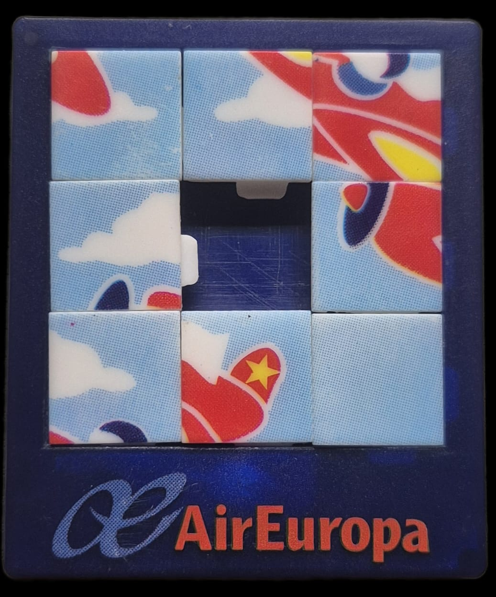
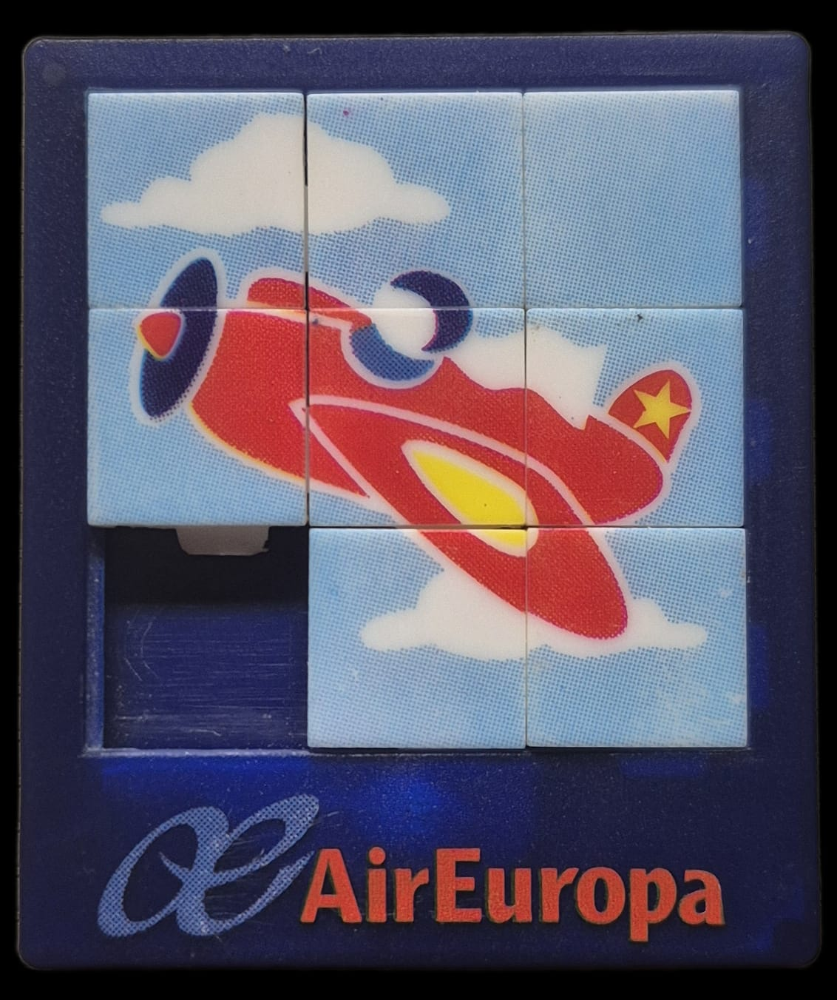

# The 8-Puzzle Game

## How it started
Years ago, while traveling with Air Europa, the airline gifted this mini-puzzle to all the children on board.
Coincidentally, my mother found it just a few weeks ago and gave it to me. At that exact time, I happened to be learning how to solve these types of puzzles at university. 
It was the perfect opportunity to apply my new knowledge to solve it!

## What I used

- ### BF-Search
At the start I tried to solve it with BF-Search, as it would give the solution with less movements possible, but there was a huge problem with that, there would be so many states I would encounter with a combinatorial explosion! Resulting in a problem supposedly with no solution.

- ### A* Algorythm
After implementing the A* algorythm, I started getting solutions! As it's an informed search algorythm, it 'ignores' the irrelevant or worse states. It's a very optimal algorythm!

## Finally solving the puzzle
- ### Unsolved

- ### Solved
